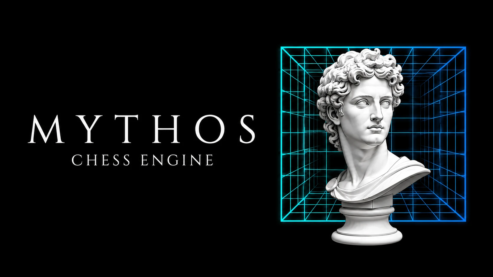

<div align="center">



**A free and strong UCI chess engine written from scratch in Rust.**

[](https://github.com/iambhabha/MythosChess/actions/workflows/ci.yml)
[](https://github.com/iambhabha/MythosChess/releases/latest)
[](https://www.rust-lang.org)
[](https://backscattering.de/chess/uci/)
[](#-license)
[](#-build--run)

[Download](https://github.com/iambhabha/MythosChess/releases/latest) ·
[Play](#-play-against-mythos) ·
[Features](#-features) ·
[Build](#-build--run) ·
[Strength](#-how-strong-is-it) ·
[How it works](#-how-it-works) ·
[Roadmap](#-roadmap)

</div>

---

## Overview

**Mythos** is a chess engine that analyzes positions and plays strong moves. Like
most engines it has **no graphical interface** — it speaks the standard **UCI**
protocol, so it plugs into any chess GUI, *or* you can play it right in your
**web browser** using the tiny bundled server.

It is a **from-scratch, learning-driven** engine: every subsystem was understood
by studying the [Stockfish](https://github.com/official-stockfish/Stockfish) C++
engine, then reimplemented idiomatically in Rust — bitboards, a modern
alpha‑beta search, a tapered hand‑crafted evaluation, and an **optional NNUE
neural‑network evaluation** with its own self‑play data generator and GPU trainer.

> **Honest note:** Mythos is a young engine. It already beats most human players,
> but it is **not** in the league of top engines like Stockfish (see
> [How strong is it?](#-how-strong-is-it)). It is built to learn, measure, and
> improve — one tested change at a time.

## ✨ Features

**Board & move generation**
- Bitboard board representation with **magic‑bitboard** sliding‑piece attacks
- Fast, pin‑ and check‑aware **legal move generation**, validated by `perft`
  against every canonical node count (start position depth 6 = `119,060,324`)
- Zobrist hashing with incremental updates

**Search** (the "brain")
- Fail‑soft **alpha‑beta** with iterative deepening and **principal variation search**
- **Quiescence search** to escape the horizon effect
- **Transposition table**, aspiration windows, and a full pruning toolkit:
  null‑move, late move reductions (LMR), late move pruning, futility, reverse
  futility, delta pruning, and **SEE**‑based capture pruning
- Rich move ordering: TT move, SEE‑ordered captures, killers, history heuristic

**Evaluation**
- **Tapered hand‑crafted evaluation**: material + piece‑square tables, mobility,
  king safety, passed pawns, pawn structure, bishop pair, rook on open file, tempo
- **Optional NNUE** (neural network) evaluation with an **incrementally updated
  accumulator** for fast inference

**NNUE pipeline** (train your own evaluation)
- `datagen` — multi‑threaded self‑play **data generator**
- `train_nnue.py` — a **PyTorch GPU trainer** that exports Mythos's `.nnue` format
- In‑engine inference that loads a net and evaluates positions

**Interfaces & tooling**
- Full **UCI** protocol with a threaded search (`stop` works mid‑think)
- A self‑contained **browser UI** to play against the engine locally
- `selfplay` — a mini "Fishtest": plays two engine builds and reports the Elo gap

## ♟️ Play against Mythos

### In your browser (easiest)

```sh
cargo run --release --bin webserver     # then open http://localhost:8080
```

Pick your color and strength, and play — with move highlights, legal‑move dots,
promotion picker, **undo**, **board flip**, and a **board‑size slider**.

### In a chess GUI

Mythos speaks UCI, so point any UCI GUI at the built binary
(`target/release/mythos`). Great free GUIs: **Cute Chess**, **Arena**,
**BanksiaGUI**, **En Croissant**. Or drive it by hand:

```
uci
position startpos moves e2e4 e7e5
go movetime 2000
```

## 🛠️ Build & run

Mythos needs only a stable **Rust** toolchain (`rustup`) — no external
dependencies for the engine itself.

```sh
cargo build --release                  # compile the optimized engine
cargo run   --release                  # start the UCI engine
cargo run   --release --bin webserver  # play in the browser at localhost:8080
cargo test                             # ~132 unit tests
cargo test  --release -- --ignored     # deep perft correctness tests
cargo run   --release -- bench         # quick perft speed benchmark
```

Optional NNUE trainer (needs Python + PyTorch with CUDA for GPU training):

```sh
cargo run --release --bin datagen -- data.txt --games 20000   # self-play data
python train_nnue.py data.txt mythos.nnue --epochs 50          # train on GPU
```

> 📘 Full step-by-step guide: **[docs/TRAINING.md](docs/TRAINING.md)** — how to
> generate data, train a net on the GPU, use it, and make it stronger.

## 📈 How strong is it?

Every change is measured by self‑play (`selfplay` harness) before it is kept.
Starting from the first playable version, the search and evaluation work so far
has added a large, **measured** amount of strength:

| Improvement round | Measured gain |
| --- | --- |
| Null‑move, LMR, aspiration windows, SEE | **+223 Elo** |
| Full positional evaluation | **+58 Elo** |
| Faster legal move generation | **+44 Elo** |
| History gravity + malus, improving heuristic, history‑LMR | **+58 Elo** |
| Improving‑aware LMP + history pruning | **+35 Elo** |
| **Cumulative** | **≈ +413 Elo** over the first playable build |

In the same 3‑second search the current engine reaches **depth 17** where the
first playable build reached depth 8.

### 🏅 Benchmark — calibrated against Stockfish 18

Mythos's absolute strength was **measured** by playing it against **Stockfish 18**
capped to fixed Elo levels (single thread, 0.4 s/move, 14–20 games per level):

| Opponent — Stockfish 18 at | Result (Mythos W–L–D) | Mythos score |
| --- | --- | --- |
| `UCI_Elo 2000` | 20 – 0 – 0 | **100 %** |
| `UCI_Elo 2400` | 14 – 3 – 3 | **77.5 %** |
| `UCI_Elo 2600` | 4 – 5 – 5 | **46.4 %** — roughly even |
| **Full strength** (~3600) | 0 – 10 – 0 | **0 %** — the ceiling |

The table above was measured on the **v0.1.0** build (even with Stockfish at
2600 Elo). Later search rounds added a further **+58** and **+35 Elo** (self‑play), so the
current build sits at roughly **≈ 2685 Elo** — enough to beat the vast majority of
human players, and squarely in the class of the great *classical* (hand‑crafted)
engines. Against a full‑strength modern engine it is, honestly, crushed 0–10 —
that is the ~1000‑Elo gap that NNUE plus a decade of tuning buys.

> The Stockfish‑at‑fixed‑Elo numbers are an **approximate** calibration (short
> games, and Stockfish's strength‑limiting is itself noisy); the self‑play Elo
> gains between Mythos versions are the precise, apples‑to‑apples measurements.

### 🌍 Where Mythos stands

Approximate published community ratings (CCRL), strongest first — the modern
NNUE top tier, the classic hand‑crafted engines, and where Mythos lands:

| Engine | Eval | ≈ Elo |
| --- | --- | --- |
| Stockfish 17 | NNUE | ~3780 |
| Obsidian | NNUE | ~3750 |
| Komodo Dragon 3 | NNUE | ~3730 |
| Berserk 13 | NNUE | ~3730 |
| Leela Chess Zero | neural net | ~3700 |
| RubiChess · Igel | NNUE | ~3700 |
| Ethereal | NNUE | ~3690 |
| Arasan | NNUE | ~3670 |
| Crafty 25 | hand‑crafted | ~3040 |
| Fruit 2.1 | hand‑crafted | ~2690 |
| **➡️ Mythos** | **hand‑crafted** | **~2685** *(self‑play calibration)* |

> These are approximate ratings from different lists (mostly CCRL Blitz / 40‑15)
> and are **not** directly comparable to a self‑play calibration — treat the table
> as a rough landscape, not a leaderboard. Mythos already plays in the tier of the
> classic hand‑crafted engines; closing the gap to the NNUE top tier is the
> long‑term [roadmap](#-roadmap).

## 🧠 How it works

```
                 UCI / browser
                       │
        ┌──────────────▼──────────────┐
        │            Search           │   alpha-beta + iterative deepening,
        │  (transposition table,      │   PVS, quiescence, null-move, LMR,
        │   move ordering, pruning)   │   aspiration, futility, SEE …
        └───────┬──────────────┬──────┘
                │              │
     ┌──────────▼───┐   ┌──────▼───────────────┐
     │  Evaluation  │   │  Move generation     │   magic bitboards,
     │  HCE  or  NNUE│   │  (legal, pin-aware)  │   pin/check-aware legality
     └──────────────┘   └──────────────────────┘
```

The search explores the game tree; at the leaves the **evaluation** scores each
position (either the hand‑crafted eval or a loaded NNUE net); move generation
feeds it legal moves. The transposition table and pruning heuristics let it look
many moves deep in a fraction of a second.

## 📚 Documentation

| Doc | What's inside |
| --- | --- |
| **[Architecture](docs/ARCHITECTURE.md)** | How the whole engine works, subsystem by subsystem |
| **[Training](docs/TRAINING.md)** | Generate data, train the NNUE on a GPU, use it |
| **[Improving](docs/IMPROVING.md)** | Concrete, measured ways to make Mythos stronger |
| **[Contributing](CONTRIBUTING.md)** | Build, test, the "measure everything" rule, PRs |
| **[Releasing](docs/RELEASING.md)** | Version, build binaries, publish a GitHub release |

## 🗺️ Roadmap

- [x] **Foundation** — bitboards, magic attacks, `perft`‑verified legal movegen
- [x] **Playable engine** — alpha‑beta search, TT, evaluation, UCI, browser UI
- [x] **Strength** — null‑move, LMR, aspiration, LMP, futility, SEE, positional
      eval, faster legal movegen *(measured, ongoing)*
- [x] **NNUE pipeline** — self‑play datagen, GPU trainer, incremental inference
- [ ] **Faster NNUE** — SIMD + int8 quantization so the net beats the hand‑eval
- [ ] **Stronger NNUE** — iterative self‑play training, richer features
- [ ] **Lazy SMP** multithreading, **Syzygy** tablebases, profile‑guided builds

## 📂 Project layout

```
src/
  types.rs      core value types (Color, Piece, Square, Move, …)
  bitboard.rs   the 64-bit board-set primitive (+ between/line tables)
  attacks.rs    knight/king/pawn tables + magic-bitboard sliders
  zobrist.rs    position hashing keys
  position.rs   board state, FEN, make/undo move
  movegen.rs    fast pin/check-aware legal move generation
  perft.rs      move-generation correctness counter
  eval.rs       tapered hand-crafted evaluation
  see.rs        static exchange evaluation (capture math)
  tt.rs         transposition table
  search.rs     alpha-beta search — the brain
  nnue.rs       NNUE inference + incremental accumulator
  uci.rs        UCI protocol loop
  lib.rs        module wiring + re-exports
  main.rs       the `mythos` binary entry point
  bin/
    webserver.rs  local web server — play Mythos in a browser
    selfplay.rs   match harness: plays two engines, reports Elo
    datagen.rs    self-play NNUE training-data generator
    train.rs      (CPU trainer; the GPU one is train_nnue.py)
train_nnue.py   PyTorch GPU trainer for the NNUE evaluation
web/index.html  the self-contained browser chess UI
```

## ❓ FAQ

**Where does the logo come from?**
The Mythos branding is **AI-generated by the project owner**: the artwork —
a marble bust of the Greek god **Apollo** inside a glowing neon chessboard
grid — was generated with **Google Gemini** and **ChatGPT**, and the final
assets were merged and composited using **[GIMP](https://www.gimp.org/)**.

<details>
<summary>The generation prompt used for the banner</summary>

> A cinematic, ultra-widescreen GitHub repository banner (16:9 aspect ratio)
> for a chess engine. On a solid obsidian black background, the text
> "M Y T H O S" is written in a premium, elegant white serif font with wide
> letter spacing, and below it, the subtext "CHESS ENGINE" is written in a
> smaller, clean white font. Next to the typography, there is a minimalist
> white marble statue bust of Greek God Apollo in clean vector line art, with
> a futuristic 3D chess board grid glowing with vivid neon cyan and electric
> blue lines positioned directly behind the statue. High contrast, premium
> tech aesthetic, clean and elegant developer theme.

</details>

**Why the name "Mythos"?**
*Mythos* (μῦθος) is the Greek word for *legend* — the counterpart of *logos*
(logic and calculation). A chess engine is pure logos wearing a mythic name.

## 🙏 Acknowledgements

- The [Stockfish](https://github.com/official-stockfish/Stockfish) project — the
  reference this engine was learned from.
- The [Chess Programming Wiki](https://www.chessprogramming.org) — an incredible
  resource for every technique used here.
- The **PeSTO** piece‑square tables, the basis of the hand‑crafted evaluation.

## 📜 License

Mythos is free software, licensed under the **GNU General Public License v3.0 or
later** (GPL‑3.0‑or‑later). Because it was developed by studying the GPL‑licensed
Stockfish, any distributed version must also be GPL‑3.0 and ship its full source.
See [Copying.txt](https://www.gnu.org/licenses/gpl-3.0.txt) for the full text.
</content>
